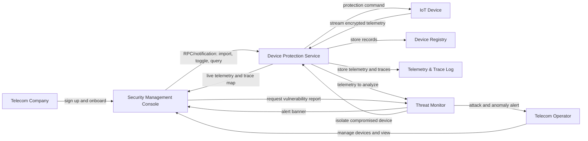

# IoT Lighthouse

IoT Lighthouse is an Atsign Platform application for telecom teams managing protected signaling devices and gateways across Diameter and SS7 networks. It includes a Flutter Security Management Console plus Dart agents for the Device Protection Service, Threat Monitor, and a synthetic signaling-device simulator.

## Nodes And Atsigns

| Node | Runtime | Atsign model | Notes |
| --- | --- | --- | --- |
| Telecom Company | AtKeys | Operator-owned Atsign namespace | Company profile, subscription state, and protected asset classes live as encrypted AtKeys. |
| Telecom Operator | Flutter app user | `@lyra6dj01_sp` | Authenticates with keychain, registrar onboarding, APKAM, or `.atKeys`; manages Diameter and SS7 signaling assets. |
| Security Management Console | Flutter | Operator Atsign using namespace `iotlighthouse` | Imports signaling devices, toggles protection, lists telemetry, and displays alerts. |
| Device Protection Service | Dart CLI agent | Dedicated trusted Atsign, default `@lyra6dj02_sp` | Maintains registry, receives operator commands, stores traces, and forwards device commands. |
| IoT Device | Dart/device runtime | `@lyra6dj04_sp` | Represents a Diameter node, SS7 gateway, or adjacent signaling appliance publishing encrypted telemetry and receiving protection commands. |
| Device Registry | AtKeys | Service/operator shared keys | Stores device records, current protection state, and import source. |
| Telemetry & Trace Log | AtKeys | Service-owned and shared keys | Stores readings and traceability events per device. |
| Threat Monitor | Dart CLI agent | Dedicated trusted Atsign, default `@lyra6dj03_sp` | Analyzes telemetry and publishes ranked security alerts. |

## Namespace

All application data uses the namespace `iotlighthouse`.

Key names are built in [lib/services/at_keys.dart](lib/services/at_keys.dart). Data is stored as AtKeys and synchronized by the Atsign SDK; application data is not stored in local files.

## First-Run Atsign Gate

The console starts at [lib/main.dart](lib/main.dart). On launch it calls `KeychainStorage().getAllAtsigns()`. If no Atsigns exist on the device, it blocks access with [lib/auth/atsign_gate_screen.dart](lib/auth/atsign_gate_screen.dart). The user can open the Starter Pack URL, then press Continue to reach the auth screen.

Starter Pack URL: https://my.atsign.com/starterpack_app

## Authentication Workflows

[lib/auth/welcome_screen.dart](lib/auth/welcome_screen.dart) exposes all required auth paths through [lib/services/at_auth_service.dart](lib/services/at_auth_service.dart):

| Workflow | Implementation |
| --- | --- |
| Login from Keychain | `KeychainStorage().getAllAtsigns()` -> `AtSignSelectionDialog.show(existingAtSigns: ...)` -> `AtAuthRequest(... KeychainAtKeysIo())` -> `PkamDialog.show()` |
| Onboard a New Atsign | `AtSignSelectionDialog.show()` -> `RegistrarCramDialog.show()` with `RegistrarService(registrarUrl: 'my.atsign.com', apiKey: ...)` -> `CramDialog.show()` |
| APKAM enrollment | `AtSignSelectionDialog.show()` -> `ApkamActivationDialog.show()` -> `AtAuthRequest(... atAuthKeys: ...)` -> `PkamDialog.show()` |
| Login via `.atKeys` file | `AtKeysFileDialog.show()` -> `FileAtKeysIo.getAtsign()` -> `AtAuthRequest(... atKeysIo: ...)` -> `PkamDialog.show(backupKeys: [KeychainAtKeysIo()])` |

All Atsign strings are validated with `.toAtsign()` before use.

## Data Flows



## MVP Encryption Proof

The hackathon MVP hardcodes telecom signaling-device specifications so the demo is reliable, but it uses synthetic telemetry to prove the end-to-end privacy flow. When the demo fleet is imported, the app creates a route-specific encrypted telemetry envelope from a Diameter/SS7 device Atsign to the Device Protection Service Atsign:

```text
@lyra6dj04_sp -> @lyra6dj02_sp
```

The app shows:

- plaintext synthetic telemetry
- encrypted payload
- HMAC digest
- decrypted payload
- verification status

This local proof demonstrates the intended security property in the demo. The production Atsign path uses encrypted AtKeys and Atsign notifications with `sharedWith`, so Diameter/SS7 telemetry and protection commands are encrypted for the target Atsign and are not stored in plaintext by a central application backend.

## Key Table

| Purpose | Key pattern | Owner/writer | Shared with |
| --- | --- | --- | --- |
| Company profile/action envelope | `company.profile.iotlighthouse@owner` | Console | Device Protection Service |
| Device registry | `devices.registry.iotlighthouse@owner` | Console or service | Service/operator as needed |
| Device record | `device.<deviceId>.record.iotlighthouse@owner` | Service | Operator |
| Telemetry reading | `telemetry.<deviceId>.<readingId>.iotlighthouse@device` | Device | Device Protection Service |
| Trace log | `trace.<deviceId>.log.iotlighthouse@service` | Device Protection Service | Operator |
| Protection command | `command.<deviceId>.protection.iotlighthouse@service` | Service or monitor | Device or service |
| Alert feed | `alerts.feed.iotlighthouse@monitor` | Threat Monitor | Operator/console |
| Alert detail | `alert.<alertId>.iotlighthouse@monitor` | Threat Monitor | Operator/console |
| Agent mutex | `mutex.<requestId>.iotlighthouse@agent` | Agent instance | Not shared |

## JSON Formats

Device record:

```json
{
  "id": "diameter-edge-001",
  "label": "Diameter Edge Router - Core Site A",
  "deviceAtSign": "@towergateway001",
  "protectionState": "enabled",
  "source": "manual",
  "firmwareVersion": "2.4.1",
  "protocol": "diameter",
  "lastSeen": "2026-06-25T20:00:00.000Z",
  "lastReading": {}
}
```

Telemetry reading:

```json
{
  "deviceId": "diameter-edge-001",
  "recordedAt": "2026-06-25T20:00:00.000Z",
  "signalStrength": -57.2,
  "temperatureC": 41.5,
  "packetLossPercent": 3.2,
  "status": "normal"
}
```

Security alert:

```json
{
  "id": "uuid",
  "deviceId": "diameter-edge-001",
  "severity": "critical",
  "title": "Possible compromise on diameter-edge-001",
  "assessment": "Plain-language suspected weakness, such as insecure Diameter routing, SS7 fallback exposure, stale firmware, or signaling tamper.",
  "recommendedFix": "Isolate, rotate credentials, inspect firmware, verify routing policy, and review signaling traffic.",
  "createdAt": "2026-06-25T20:00:00.000Z"
}
```

## Running

This workspace includes a local Flutter SDK at `.tools/flutter` when installed by Codex. For Windows desktop development, use the no-space junction path created at `C:\Users\decke\iot_lighthouse_workspace`; Flutter native assets currently trip over the original `Iot Protector` folder name.

```powershell
cd C:\Users\decke\iot_lighthouse_workspace
.\.tools\flutter\bin\flutter.bat pub get
.\.tools\flutter\bin\flutter.bat run -d windows
```

Run agents after authenticating the relevant Atsigns with Atsign CLI-compatible key material:

```powershell
.\.tools\flutter\bin\dart.bat run agents/device_protection_service.dart --atsign @lyra6dj02_sp
.\.tools\flutter\bin\dart.bat run agents/threat_monitor.dart --atsign @lyra6dj03_sp
.\.tools\flutter\bin\dart.bat run agents/iot_device_simulator.dart --atsign @lyra6dj04_sp diameter-edge-001
```

The exact CLI flags are handled by `at_cli_commons` `CLIBase`.

## Hackathon Submission Checklist

| Judging item | Project evidence |
| --- | --- |
| Repository link submitted | Submit this repository URL after pushing the final commit. |
| Commits inside window | Make final commits between June 25, 2026 12:00 PM PT and June 26, 2026 12:00 PM PT. |
| Video submitted and under 5 minutes | Suggested structure: problem, AI Architect blueprint, live auth gate/auth flow, add device, toggle protection, show agent alert. |
| AI Architect Blueprint | `ai_architect_blueprint.json` preserves the submitted blueprint; `README.md` includes the rendered flow diagram. |
| Real-world usefulness | Telecom signaling environments include Diameter nodes, SS7 gateways, HSS/HLR proxies, and interconnect appliances that face credential theft, weak legacy protocols, routing abuse, and traceability gaps; this app targets protected identity, encrypted telemetry, and operator-visible isolation workflows. |
| Technical execution | Uses Atsigns for operators, service agents, threat monitor, and devices; all synchronized application data is modeled as encrypted AtKeys. |
| Creativity | Combines identity-based IoT protection, traceability, and threat explanations without a central app backend. |
| Clarity of demo | Target audience: telecom operations and security staff managing distributed field devices. |
| Completeness | Includes Flutter console, first-run Atsign gate, four auth workflows, platform permissions, service agent, threat monitor, simulator, docs, and extensible key conventions. |
