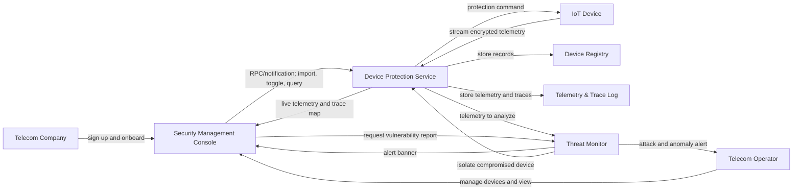

# IoT Lighthouse

IoT Lighthouse is an [Atsign](https://atsign.com) platform app for telecom teams that protect Diameter nodes, SS7 gateways, and adjacent signaling appliances. It assigns a cryptographic atSign to each operator, service agent, and device, then moves telemetry and isolation commands as encrypted AtKeys — with no central application backend.

Atsign’s write-up: [How IoT Lighthouse Secures Legacy Telecom Networks at the Identity Layer](https://www.atsign.com/articles/iot-lighthouse-telecom-identity-security). The project placed 2nd at the [AI Architect Hackathon](https://www.atsign.com/articles/celebrating-the-atsign-ai-architect-hackathon-winners).

This repository is the Flutter Security Management Console plus Dart agents for the Device Protection Service, Threat Monitor, and a signaling-device simulator.

## Architecture

Four identities share the namespace `iotlighthouse` and coordinate through atServers instead of a cloud app database:

| Identity | Runtime | Default atSign | Role |
| --- | --- | --- | --- |
| Telecom operator | Flutter console | `@lyra6dj01_sp` | Imports the demo fleet, toggles protection, reviews telemetry and alerts |
| Device Protection Service | Dart CLI agent | `@lyra6dj02_sp` | Registry, traces, and protection-command routing |
| Threat Monitor | Dart CLI agent | `@lyra6dj03_sp` | Scores telemetry and publishes ranked alerts |
| Signaling device | Dart simulator | `@lyra6dj04_sp` (and `@lyra6dj05_sp`–`@lyra6dj08_sp` in the demo fleet) | Publishes encrypted telemetry; receives protection commands |

The submitted [AI Architect](https://aiarchitect.atsign.com/) blueprint is in [`ai_architect_blueprint.json`](ai_architect_blueprint.json).


```mermaid
flowchart LR
  Company["Telecom Company"] -->|"sign up and onboard"| Console["Security Management Console"]
  Operator["Telecom Operator"] -->|"manage devices and view"| Console
  Console -->|"RPC/notification: import, toggle, query"| Service["Device Protection Service"]
  Device["IoT Device"] -->|"stream encrypted telemetry"| Service
  Service -->|"protection command"| Device
  Service -->|"store records"| Registry["Device Registry"]
  Service -->|"store telemetry and traces"| Trace["Telemetry & Trace Log"]
  Service -->|"live telemetry and trace map"| Console
  Service -->|"telemetry to analyze"| Monitor["Threat Monitor"]
  Monitor -->|"attack and anomaly alert"| Operator
  Monitor -->|"alert banner"| Console
  Monitor -->|"isolate compromised device"| Service
  Console -->|"request vulnerability report"| Monitor
```

Atsign construction lives in [`lib/services/at_keys.dart`](lib/services/at_keys.dart). Platform SDK rules are in [`ATPLATFORM_GUIDELINES.md`](ATPLATFORM_GUIDELINES.md).

## Encryption

Operational records are AtKeys in namespace `iotlighthouse`, shared with `sharedWith` so only the intended atSign can decrypt them. There is no application server that stores plaintext telemetry.

The console can run a live AtKey round-trip for the Diameter edge demo device: authenticate the device `.atKeys`, write shared telemetry, authenticate the company atSign, then read and decrypt. That proof uses this route:

```text
@lyra6dj04_sp -> @lyra6dj01_sp
```

Implementation: [`lib/services/real_atsign_telemetry.dart`](lib/services/real_atsign_telemetry.dart). The traceability view shows the route, AtKey name, plaintext, decrypted value, and verification status.

## Key conventions

| Purpose | Key pattern | Writer | Shared with |
| --- | --- | --- | --- |
| Company profile / action envelope | `company.profile.iotlighthouse@owner` | Console | Device Protection Service |
| Device registry | `devices.registry.iotlighthouse@owner` | Console or service | Service / operator |
| Device record | `device.<deviceId>.record.iotlighthouse@owner` | Service | Operator |
| Telemetry reading | `telemetry.<deviceId>.<readingId>.iotlighthouse@device` | Device | Device Protection Service |
| Trace log | `trace.<deviceId>.log.iotlighthouse@service` | Device Protection Service | Operator |
| Protection command | `command.<deviceId>.protection.iotlighthouse@service` | Service or monitor | Device or service |
| Alert feed | `alerts.feed.iotlighthouse@monitor` | Threat Monitor | Operator / console |
| Alert detail | `alert.<alertId>.iotlighthouse@monitor` | Threat Monitor | Operator / console |
| Agent mutex | `mutex.<requestId>.iotlighthouse@agent` | Agent instance | Not shared |

Need an atSign? [Starter Pack](https://my.atsign.com/starterpack_app). The console activates demo identities from the dashboard (keychain, manual CRAM, APKAM, or a `.atKeys` file). Helpers are in [`lib/services/at_auth_service.dart`](lib/services/at_auth_service.dart). Validate every atSign with `.toAtsign()` before use.

## Payload shapes

Device record ([`lib/models/device_models.dart`](lib/models/device_models.dart)):

```json
{
  "id": "diameter-edge-001",
  "label": "Diameter Edge Router - Core Site A",
  "deviceAtSign": "@lyra6dj04_sp",
  "protectionState": "enabled",
  "source": "demo-import:diameter-node",
  "firmwareVersion": "2.4.1",
  "protocol": "diameter",
  "lastSeen": "2026-06-25T20:00:00.000Z",
  "lastReading": {}
}
```

Telemetry reading:

```json
{
  "deviceId": "diameter-edge-001",
  "recordedAt": "2026-06-25T20:00:00.000Z",
  "signalStrength": -57.2,
  "temperatureC": 41.5,
  "packetLossPercent": 3.2,
  "status": "normal"
}
```

Security alert:

```json
{
  "id": "uuid",
  "deviceId": "diameter-edge-001",
  "severity": "critical",
  "title": "Possible compromise on diameter-edge-001",
  "assessment": "Suspected weakness such as insecure Diameter routing, SS7 fallback exposure, stale firmware, or tampering.",
  "recommendedFix": "Isolate, rotate credentials, inspect firmware, verify routing policy, and review signaling traffic.",
  "createdAt": "2026-06-25T20:00:00.000Z"
}
```

## Running

Requires a current [Flutter](https://docs.flutter.dev/get-started/install) SDK on `PATH`.

```powershell
flutter pub get
flutter run -d windows
```

On Windows, a workspace path that contains spaces (this folder is named `Iot Protector`) can break Flutter native-asset builds. If that happens, run from a junction or clone path with no spaces.

Start agents after the matching atSigns are authenticated (`at_cli_commons` `CLIBase` supplies the flags):

```powershell
dart run agents/device_protection_service.dart --atsign @lyra6dj02_sp
dart run agents/threat_monitor.dart --atsign @lyra6dj03_sp
dart run agents/iot_device_simulator.dart --atsign @lyra6dj04_sp diameter-edge-001
```

Do not commit `.atKeys` or registrar API keys. Pass a registrar key with `--dart-define=ATSIGN_REGISTRAR_API_KEY=...` when using registrar onboarding.

## Archive

The June 2026 hackathon README is preserved at [`docs/archive/README-hackathon-2026-06.md`](docs/archive/README-hackathon-2026-06.md).
