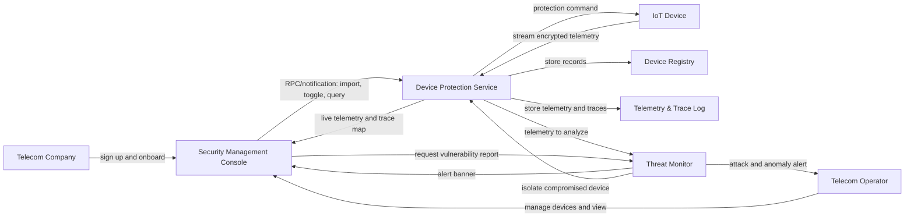

# IoT Lighthouse

IoT Lighthouse is an Atsign Platform application for telecom teams managing protected signaling devices and gateways across Diameter and SS7 networks. It demonstrates identity-based device protection, encrypted synchronized application data (AtKeys), and agent-driven monitoring and response.

## Architecture overview

- Security Management Console (Flutter app) — operator UI for onboarding, device import, protection toggles, telemetry, and alerts.
- Device Protection Service (Dart CLI agent) — registry, command forwarding, and trace storage.
- Threat Monitor (Dart CLI agent) — analyzes telemetry and publishes ranked security alerts.
- IoT Device (Dart runtime or simulator) — publishes encrypted telemetry and accepts protection commands.
- Device Registry & Telemetry store — AtKeys-based encrypted records synchronized via the Atsign SDK.

## Nodes and Atsigns

| Node | Runtime | Atsign model | Notes |
| --- | --- | --- | --- |
| Telecom Company | AtKeys | Operator-owned Atsign namespace | Company profile, subscription state, and protected asset classes stored as encrypted AtKeys. |
| Telecom Operator | Flutter app user | e.g. `@lyra6dj01_sp` | Authenticates via keychain, registrar onboarding, APKAM, or `.atKeys`; manages Diameter/SS7 signaling assets. |
| Security Management Console | Flutter | Operator Atsign (namespace `iotlighthouse`) | Console UI for operators. |
| Device Protection Service | Dart CLI agent | Dedicated service Atsign (default `@lyra6dj02_sp`) | Maintains registry, receives commands, stores traces, forwards device commands. |
| IoT Device | Dart/device runtime | Device Atsign (e.g. `@lyra6dj04_sp`) | Represents a Diameter node, SS7 gateway, or adjacent signaling appliance. |
| Device Registry | AtKeys | Service/operator shared keys | Stores device records and protection state. |
| Telemetry & Trace Log | AtKeys | Service-owned/shared keys | Stores readings and traceability events per device. |
| Threat Monitor | Dart CLI agent | Dedicated monitor Atsign (default `@lyra6dj03_sp`) | Publishes alerts and rankings. |

## Namespace

All application data uses the `iotlighthouse` namespace. Key names are defined in lib/services/at_keys.dart and stored as encrypted AtKeys synchronized by the Atsign SDK.

## First-run Atsign gate

The console app entrypoint is at `lib/main.dart`. On startup the app calls `KeychainStorage().getAllAtsigns()` and blocks access with an onboarding gate if no Atsigns are present. Use the Atsign Starter Pack to create test key material:

Starter Pack: https://my.atsign.com/starterpack_app

## Authentication workflows

Authentication and onboarding flows are implemented in `lib/auth/` and `lib/services/at_auth_service.dart`.

| Workflow | Notes |
| --- | --- |
| Login from keychain | Select an existing Atsign from the device keychain and authenticate (PKAM). |
| Onboard a new Atsign | Registrar-based onboarding (requires registrar API key). |
| APKAM enrollment | APKAM activation flow for device-bound keys. |
| Import `.atKeys` file | Load key material from a `.atKeys` file and authenticate. |

All Atsign strings are validated before use.

## Data flows


```mermaid
flowchart LR
  Company["Telecom Company"] -->|"sign up and onboard"| Console["Security Management Console"]
  Operator["Telecom Operator"] -->|"manage devices and view"| Console
  Console -->|"RPC/notification: import, toggle, query"| Service["Device Protection Service"]
  Device["IoT Device"] -->|"stream encrypted telemetry"| Service
  Service -->|"protection command"| Device
  Service -->|"store records"| Registry["Device Registry"]
  Service -->|"store telemetry and traces"| Trace["Telemetry & Trace Log"]
  Service -->|"live telemetry and trace map"| Console
  Service -->|"telemetry to analyze"| Monitor["Threat Monitor"]
  Monitor -->|"attack and anomaly alert"| Operator
  Monitor -->|"alert banner"| Console
  Monitor -->|"isolate compromised device"| Service
  Console -->|"request vulnerability report"| Monitor
```

## MVP encryption proof

The demo uses synthetic telemetry to prove the end-to-end privacy flow. For the hackathon MVP the repo hardcodes signaling-device specifications so the demo is predictable. The UI demonstrates plaintext telemetry, encrypted payload, HMAC digest, decrypted payload, and verification status to illustrate the security property. Production flows use encrypted AtKeys, Atsign notifications with `sharedWith`, and proper key management.

## Key table

| Purpose | Key pattern | Owner/writer | Shared with |
| --- | --- | --- | --- |
| Company profile/action envelope | `company.profile.iotlighthouse@owner` | Console | Device Protection Service |
| Device registry | `devices.registry.iotlighthouse@owner` | Console or service | Service/operator |
| Device record | `device.<deviceId>.record.iotlighthouse@owner` | Service | Operator |
| Telemetry reading | `telemetry.<deviceId>.<readingId>.iotlighthouse@device` | Device | Device Protection Service |
| Trace log | `trace.<deviceId>.log.iotlighthouse@service` | Device Protection Service | Operator |
| Protection command | `command.<deviceId>.protection.iotlighthouse@service` | Service/monitor | Device/service |
| Alert feed | `alerts.feed.iotlighthouse@monitor` | Threat Monitor | Operator/console |
| Alert detail | `alert.<alertId>.iotlighthouse@monitor` | Threat Monitor | Operator/console |
| Agent mutex | `mutex.<requestId>.iotlighthouse@agent` | Agent instance | (not shared) |

## JSON formats (examples)

Device record:

```json
{
  "id": "diameter-edge-001",
  "label": "Diameter Edge Router - Core Site A",
  "deviceAtSign": "@towergateway001",
  "protectionState": "enabled",
  "source": "manual",
  "firmwareVersion": "2.4.1",
  "protocol": "diameter",
  "lastSeen": "2026-06-25T20:00:00.000Z",
  "lastReading": {}
}
```

Telemetry reading:

```json
{
  "deviceId": "diameter-edge-001",
  "recordedAt": "2026-06-25T20:00:00.000Z",
  "signalStrength": -57.2,
  "temperatureC": 41.5,
  "packetLossPercent": 3.2,
  "status": "normal"
}
```

Security alert:

```json
{
  "id": "uuid",
  "deviceId": "diameter-edge-001",
  "severity": "critical",
  "title": "Possible compromise on diameter-edge-001",
  "assessment": "Suspected weakness such as insecure Diameter routing, SS7 fallback exposure, stale firmware, or tampering.",
  "recommendedFix": "Isolate, rotate credentials, inspect firmware, verify routing policy, and review signaling traffic.",
  "createdAt": "2026-06-25T20:00:00.000Z"
}
```

## Running

This workspace can use the Flutter SDK included by the Codex toolchain under `.tools/flutter` when present. For local development install Flutter and run:

```bash
# fetch dependencies
.tools/flutter/bin/flutter pub get
# run the desktop app (example)
.tools/flutter/bin/flutter run -d windows
```

Run agents after authenticating the relevant Atsigns (example):

```bash
.tools/flutter/bin/dart run agents/device_protection_service.dart --atsign @lyra6dj02_sp
.tools/flutter/bin/dart run agents/threat_monitor.dart --atsign @lyra6dj03_sp
.tools/flutter/bin/dart run agents/iot_device_simulator.dart --atsign @lyra6dj04_sp diameter-edge-001
```

CLI flags are parsed using `at_cli_commons` `CLIBase`.

## Hackathon submission notes

- Repository and demo artifacts submitted as part of the hackathon window should include commit history and a short demo video.
- The repo includes an AI Architect Blueprint (`ai_architect_blueprint.json`) and a rendered flow diagram in this README.
- Target audience: telecom operations and security staff responsible for distributed signaling devices.

---

For developer details, see:

- lib/main.dart (app entry)
- lib/services/at_keys.dart (key naming conventions)
- lib/auth (authentication flows)
- agents/ (device/service/monitor agents)
